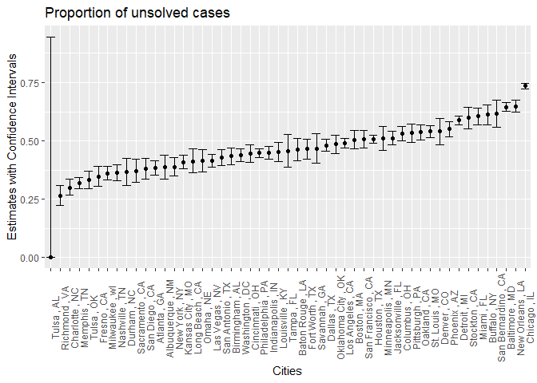
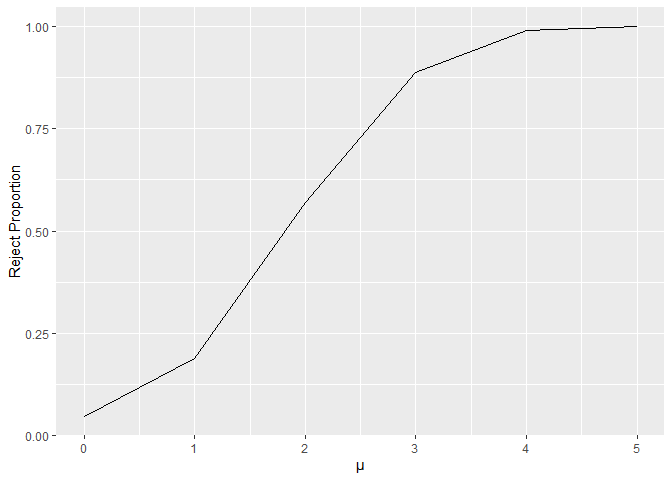
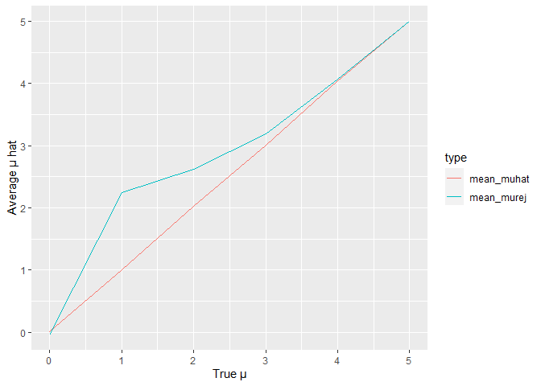

p8105_hw5_zl3263
================
2022-11-15

``` r
library(tidyverse)
```

    ## ── Attaching packages ─────────────────────────────────────── tidyverse 1.3.2 ──
    ## ✔ ggplot2 3.3.6      ✔ purrr   0.3.4 
    ## ✔ tibble  3.1.8      ✔ dplyr   1.0.10
    ## ✔ tidyr   1.2.0      ✔ stringr 1.4.1 
    ## ✔ readr   2.1.2      ✔ forcats 0.5.2 
    ## ── Conflicts ────────────────────────────────────────── tidyverse_conflicts() ──
    ## ✖ dplyr::filter() masks stats::filter()
    ## ✖ dplyr::lag()    masks stats::lag()

``` r
library(purrr)
```

### Problem 2

``` r
homicides = read_csv("https://raw.githubusercontent.com/washingtonpost/data-homicides/master/homicide-data.csv")%>%
   janitor::clean_names()
```

    ## Rows: 52179 Columns: 12
    ## ── Column specification ────────────────────────────────────────────────────────
    ## Delimiter: ","
    ## chr (9): uid, victim_last, victim_first, victim_race, victim_age, victim_sex...
    ## dbl (3): reported_date, lat, lon
    ## 
    ## ℹ Use `spec()` to retrieve the full column specification for this data.
    ## ℹ Specify the column types or set `show_col_types = FALSE` to quiet this message.

**Description**

The dataset record the homicides information of 50 U.S cities. It
contains 52179 observations and 12 variables.The key variables include
victims’ name, sex, age and race. The
location(`city`,`state`,`lat`,`lon`) and report time are also recorded.

**Count unsolved numbers**

``` r
homicides = homicides %>%
  mutate(
    city_state = paste(city,",",state)
  )

solve_count = homicides %>%
  group_by(city_state) %>%
  summarise(
    total = n(),
    unsolved = sum(disposition == "Closed without arrest") + sum(disposition == "Open/No arrest")
    
  )

solve_count
```

    ## # A tibble: 51 × 3
    ##    city_state       total unsolved
    ##    <chr>            <int>    <int>
    ##  1 Albuquerque , NM   378      146
    ##  2 Atlanta , GA       973      373
    ##  3 Baltimore , MD    2827     1825
    ##  4 Baton Rouge , LA   424      196
    ##  5 Birmingham , AL    800      347
    ##  6 Boston , MA        614      310
    ##  7 Buffalo , NY       521      319
    ##  8 Charlotte , NC     687      206
    ##  9 Chicago , IL      5535     4073
    ## 10 Cincinnati , OH    694      309
    ## # … with 41 more rows

**Proportion test on Baltimore**

``` r
test_baltimore = prop.test(1825, 2827)%>%
  broom::tidy()
test_baltimore
```

    ## # A tibble: 1 × 8
    ##   estimate statistic  p.value parameter conf.low conf.high method        alter…¹
    ##      <dbl>     <dbl>    <dbl>     <int>    <dbl>     <dbl> <chr>         <chr>  
    ## 1    0.646      239. 6.46e-54         1    0.628     0.663 1-sample pro… two.si…
    ## # … with abbreviated variable name ¹​alternative

**Proportion test on all the cities**

``` r
solve_count = 
solve_count %>%
  mutate(
    prop_test = map2(.x = unsolved, .y = total, ~ broom::tidy(prop.test(.x, .y)))
  ) %>%
  unnest(cols = prop_test) %>%
  select(-c("parameter","method","alternative"))
```

    ## Warning in prop.test(.x, .y): Chi-squared近似算法有可能不准

``` r
head(solve_count)
```

    ## # A tibble: 6 × 8
    ##   city_state       total unsolved estimate statistic  p.value conf.low conf.high
    ##   <chr>            <int>    <int>    <dbl>     <dbl>    <dbl>    <dbl>     <dbl>
    ## 1 Albuquerque , NM   378      146    0.386   19.1    1.23e- 5    0.337     0.438
    ## 2 Atlanta , GA       973      373    0.383   52.5    4.32e-13    0.353     0.415
    ## 3 Baltimore , MD    2827     1825    0.646  239.     6.46e-54    0.628     0.663
    ## 4 Baton Rouge , LA   424      196    0.462    2.27   1.32e- 1    0.414     0.511
    ## 5 Birmingham , AL    800      347    0.434   13.8    2.05e- 4    0.399     0.469
    ## 6 Boston , MA        614      310    0.505    0.0407 8.40e- 1    0.465     0.545

**Plot**

``` r
solve_count %>%
  ggplot(aes(x = reorder(city_state, estimate), y = estimate)) +
      geom_point() +
      geom_errorbar(aes(ymin = conf.low, ymax = conf.high)) +
      labs(
        x = "Cities",
        y = "Estimates with Confidence Intervals",
        title = "Proportion of unsolved cases"
      ) +
      theme(
        axis.text.x = element_text(angle = 90)
      )
```

<!-- -->

### Problem 3

**generate simulation data**

``` r
simtest_muhat = function(mu, sigma = 5, n = 30){
  
  x = rnorm(n = n, mean = mu, sd = sigma)
  
  result = t.test(x,mu = 0) %>%
    broom::tidy()%>%
    select(estimate,p.value)
  
  
  return(result)
}

sim_results_df = 
  expand_grid(
    mu = c(0, 1, 2, 3, 4, 5),
    iter = 1:5000
  ) %>% 
  mutate(
    test_coef = map(mu, simtest_muhat)
  ) %>% 
  unnest(test_coef)
```

**Plot**

``` r
sim_results_df %>%
  mutate(
    reject = ifelse(p.value < 0.05, TRUE, FALSE)
  )%>%
  group_by(mu) %>%
  summarise(
    rej_r = sum(reject)/n()
  ) %>%
  ggplot(aes(x = mu, y = rej_r)) +
  geom_line() +
  labs(
    x = "μ",
      y = "Reject Proportion",
  )
```

<!-- -->

The plot shows the rejected proportion of each $\mu$ at h0: $\mu = 0$ to
be tested. According to the plot, the effect size have positive
relationship with the power of test.

``` r
sim_results_df %>%
  mutate(
    reject = ifelse(p.value < 0.05, TRUE, FALSE)
  ) %>%
  group_by(mu) %>%
  summarise(
    mean_muhat = mean(estimate),
    mean_murej = sum(estimate*as.numeric(reject))/sum(reject)
  ) %>%
  pivot_longer(
    mean_muhat:mean_murej,
    names_to = "type",
    values_to = "mean_mu"
  )%>%
  ggplot(aes(x = mu, y = mean_mu, color = type)) +
  geom_line()+
  labs(
    x = "True μ",
      y = "Average μ hat",
  )
```

<!-- -->
When the true $\mu$ is close but not equal to the $\mu$ value (0) in H0,
the average of \$ \$ is away from the true $\mu$, because when
$\hat{\mu}$ is close enough to 0 test fail to reject H0. As the true
$\mu$ gets more and more faraway from the $\mu$ to be tested, in fewer
case the “fail to reject” happens and $\hat{\mu}$ get closer to true
$\mu$
